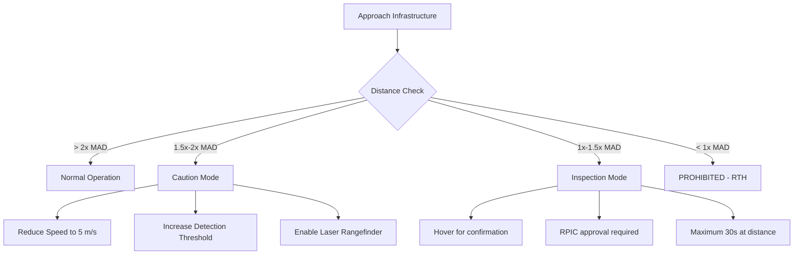
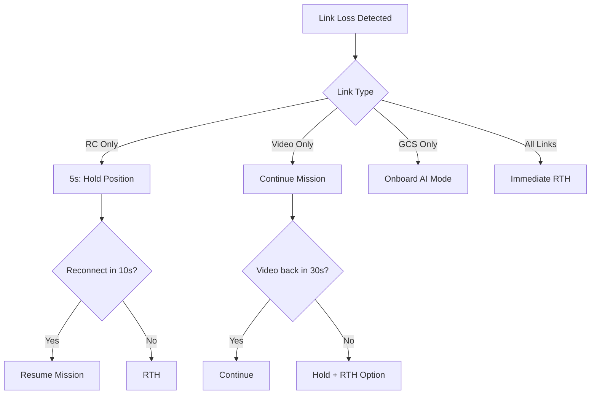
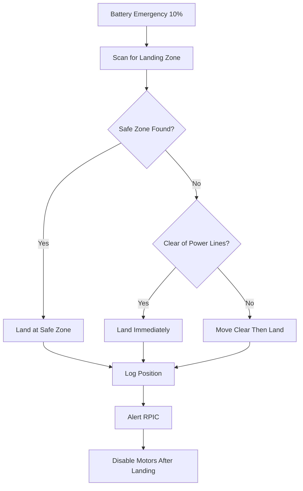
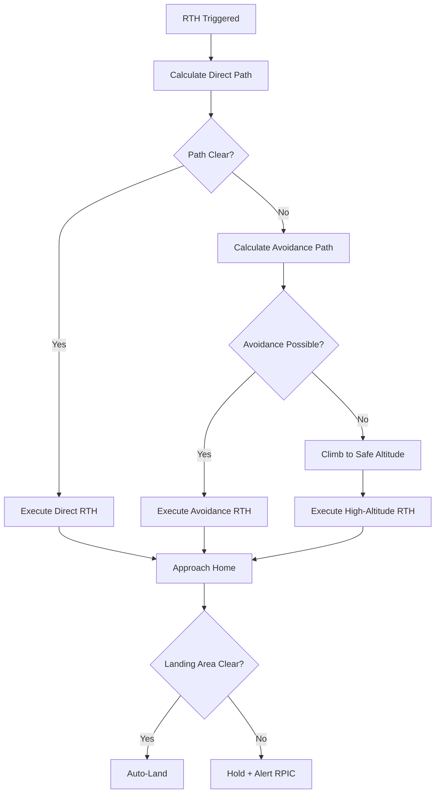
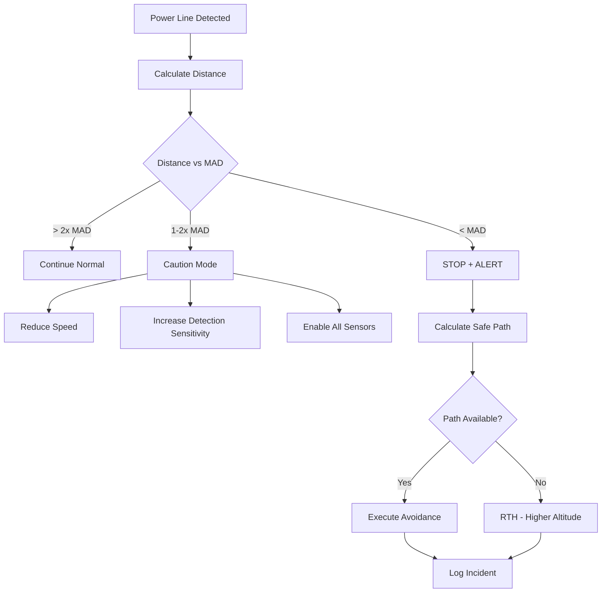

# BAHB Autonomous Drone Inspection - Comprehensive Safety Analysis

## Document Control
| Version | Date | Author | Status |
|---------|------|--------|--------|
| 1.0 | 2026-01-25 | Safety Engineering | DRAFT - REQUIRES REVIEW |

## Platform Overview
- **Aircraft**: DJI Matrice 4TD
- **Compute**: Manifold 3 with NVIDIA Orin NX (100 TOPS)
- **AI Models**: RF-DETR Seg (primary detection), SAM3 Nano, Qwen2.5-VL
- **Operations**: Power infrastructure inspection (high-voltage environments)
- **Regulatory Framework**: FAA Part 107, potential BVLOS waivers

---

# 1. OPERATIONAL SAFETY

## 1.1 Geofencing Requirements Near Power Lines

### 1.1.1 Exclusion Zones

| Zone Type | Voltage Class | Minimum Distance | Buffer Zone |
|-----------|---------------|------------------|-------------|
| Hard Exclusion | 765 kV | 15 meters | +5 meters |
| Hard Exclusion | 500 kV | 12 meters | +4 meters |
| Hard Exclusion | 345 kV | 10 meters | +3 meters |
| Hard Exclusion | 230 kV | 8 meters | +3 meters |
| Hard Exclusion | 115 kV | 6 meters | +2 meters |
| Hard Exclusion | 69 kV | 5 meters | +2 meters |
| Caution Zone | All | Buffer to 2x minimum | N/A |
| Inspection Zone | All | Buffer to minimum | Active monitoring |

### 1.1.2 Dynamic Geofence Implementation

```
REQUIREMENT: GEO-001
The system SHALL implement dynamic geofencing based on:
- Pre-loaded infrastructure GIS data
- Real-time power line detection from RF-DETR Seg
- Voltage class estimation from component detection
- Wind-adjusted safety margins
```

**Current Implementation Status**: PARTIAL
- Static geofencing exists in `configs/production.yaml` (max_distance: 500m from home)
- Dynamic power line geofencing: NOT IMPLEMENTED

**CRITICAL GAP**: Dynamic geofence adjustment based on detected infrastructure

### 1.1.3 Geofence Violation Response

| Violation Level | Response | Automation Level |
|----------------|----------|------------------|
| Approaching (90%) | Audio/visual alert | Automated |
| Warning (95%) | Reduce speed, alert RPIC | Automated |
| Breach (100%) | Hold position, alert | Automated |
| Critical (110%) | Immediate RTH | Automated |

## 1.2 Electromagnetic Interference (EMI) Considerations

### 1.2.1 EMI Sources in Power Infrastructure

| Source | Frequency Range | Risk Level | Mitigation |
|--------|----------------|------------|------------|
| Corona discharge | 100 kHz - 30 MHz | HIGH | GPS backup, optical navigation |
| High-voltage AC | 60 Hz harmonics | MEDIUM | Shielded compass, magnetometer calibration |
| Substation equipment | Variable | MEDIUM | Signal strength monitoring |
| Communication lines | RF spectrum | LOW | Frequency hopping |

### 1.2.2 EMI Impact on Systems

| System | Vulnerability | Mitigation |
|--------|---------------|------------|
| GPS | Signal degradation near corona | RTK correction, visual odometry backup |
| Compass | Magnetic interference | GPS-based heading, INS integration |
| RC Link | Possible interference | O3+ transmission, dual-band operation |
| Camera | Minimal | Shielded cabling |
| AI Inference | None | On-board processing |

**REQUIREMENT: EMI-001**
```
The system SHALL monitor and log the following EMI indicators:
- GPS HDOP and satellite count
- Compass deviation from GPS heading
- RC signal strength and quality
- GPS fix type and RTK status
```

**Current Implementation**: EXISTS in `/home/user/BAHB/bahb/operations/safety_monitor.py`
- GPS satellite monitoring: IMPLEMENTED
- Signal strength monitoring: IMPLEMENTED
- Compass deviation monitoring: NOT IMPLEMENTED

## 1.3 Safe Approach Distances to Energized Equipment

### 1.3.1 Minimum Approach Distance (MAD) Table

Based on OSHA 29 CFR 1926.1408 and IEEE C2-2017:

| Voltage (Phase-to-Phase) | MAD (meters) | Recommended Inspection Distance |
|--------------------------|--------------|--------------------------------|
| 50 kV and below | 3.05 | 5 meters minimum |
| 51-200 kV | 4.60 | 7 meters minimum |
| 201-350 kV | 6.10 | 9 meters minimum |
| 351-500 kV | 7.92 | 11 meters minimum |
| 501-750 kV | 10.67 | 14 meters minimum |
| 751-1000 kV | 13.72 | 17 meters minimum |

### 1.3.2 Approach Protocol



## 1.4 Weather Limitations

### 1.4.1 Operational Envelope

| Parameter | Limit | Current Config | Status |
|-----------|-------|----------------|--------|
| Maximum Wind | 12 m/s sustained | 12 m/s | CONFIGURED |
| Maximum Gust | 15 m/s | NOT CONFIGURED | GAP |
| Minimum Visibility | 1000 m | 1000 m | CONFIGURED |
| Precipitation | None allowed | NOT MONITORED | GAP |
| Temperature Range | -10C to +45C | NOT MONITORED | GAP |
| Humidity | <95% non-condensing | NOT MONITORED | GAP |
| Icing Conditions | Prohibited | NOT MONITORED | CRITICAL GAP |

### 1.4.2 Weather-Related Safety Triggers

| Condition | Detection Method | Response |
|-----------|------------------|----------|
| Wind exceeds limit | Telemetry/weather API | Pause mission, hold position |
| Visibility drops | Weather API / pilot report | RTH if below minimum |
| Precipitation detected | Weather API / sensor | Immediate RTH |
| Temperature extreme | Telemetry | Reduced mission time |
| Lightning within 10 mi | Weather API | Ground immediately |

**REQUIREMENT: WX-001**
```
The system SHALL integrate weather monitoring via:
1. OpenWeather or similar API for forecast data
2. DJI Pilot 2 real-time weather warnings
3. RPIC weather abort authority (always available)
```

**Current Implementation**: PARTIAL
- Weather API integration: NOT IMPLEMENTED (per `/home/user/BAHB/bahb/operations/preflight_checklist.py`)
- Manual weather check required before flight

---

# 2. AI SAFETY

## 2.1 Confidence Thresholds for Automated Actions

### 2.1.1 Detection Confidence Levels

Current configuration from `/home/user/BAHB/configs/matrice_4td.yaml`:

| Model | Threshold | Purpose |
|-------|-----------|---------|
| RF-DETR Seg | 0.40 | Detection threshold |
| RF-DETR Seg Mask | 0.50 | Segmentation threshold |

### 2.1.2 Action Confidence Requirements

From RPIC Advisor Agent configuration:

| Confidence Level | Threshold | Action Type | Human Approval |
|-----------------|-----------|-------------|----------------|
| Auto-action | >= 0.90 | Execute without confirmation | NOT REQUIRED |
| Recommend | 0.70 - 0.89 | Suggest action to RPIC | RECOMMENDED |
| Require approval | 0.50 - 0.69 | Must confirm before action | REQUIRED |
| Do not act | < 0.50 | Log only, no action | N/A |

**CRITICAL SAFETY REQUIREMENT: AI-001**
```
UNDER NO CIRCUMSTANCES shall the AI system:
1. Initiate flight commands without RPIC awareness
2. Override RPIC control inputs
3. Disable safety systems
4. Continue operations with degraded confidence below 0.50

The RPIC ALWAYS retains final authority over the aircraft.
```

### 2.1.3 Confidence Calibration Requirements

| Scenario | Minimum Calibration Frequency |
|----------|------------------------------|
| New deployment | Before first flight |
| Model update | Before deployment |
| Environmental change | Per mission type |
| Quarterly validation | Every 90 days |

## 2.2 Human-in-the-Loop (HITL) Requirements

### 2.2.1 Mandatory HITL Checkpoints

| Event | HITL Requirement | Timeout |
|-------|------------------|---------|
| Mission start | RPIC must confirm | None (required) |
| Anomaly detected (CRITICAL) | RPIC notification | Alert until acknowledged |
| Investigation requested | RPIC approval | 30 seconds, then skip |
| Route deviation | RPIC approval if >50m | 15 seconds |
| Emergency detected | RPIC notification | Alert + auto-response |
| Battery critical | RPIC notification | 5 seconds then auto-RTH |
| Loss of link | Auto-RTH after timeout | 10 seconds |

### 2.2.2 HITL Override Capabilities

The RPIC SHALL have the following override capabilities at all times:

1. **Pause Mission** - Hold current position
2. **Resume Mission** - Continue from pause point
3. **Skip Waypoint** - Advance to next waypoint
4. **Manual Control** - Full stick control
5. **Return to Home** - Initiate RTH
6. **Emergency Land** - Land immediately
7. **Motor Stop** - Emergency cutoff (ground only)

**Implementation Status**: EXISTS in `/home/user/BAHB/bahb/agents/dji_integration.py`

## 2.3 False Positive Impact Analysis

### 2.3.1 False Positive Consequences by Detection Type

| Detection Class | False Positive Consequence | Severity | Mitigation |
|-----------------|---------------------------|----------|------------|
| Transformer | Unnecessary investigation | LOW | Time cost only |
| Insulator | Unnecessary investigation | LOW | Time cost only |
| Hotspot | Unnecessary thermal analysis | LOW | Compute cost |
| Damage | Unnecessary close inspection | MEDIUM | Flight path deviation |
| Vegetation Encroachment | Unneeded alert | LOW | Report filtering |
| Power Line (collision) | Unnecessary avoidance | HIGH | Path deviation, mission impact |
| Person/Vehicle (safety) | Conservative safety stop | MEDIUM | Mission delay |

### 2.3.2 False Positive Rate Targets

| Detection Category | Maximum FP Rate | Current Estimate |
|-------------------|-----------------|------------------|
| Safety-critical (obstacles) | < 1% | UNKNOWN - NEEDS TESTING |
| Infrastructure equipment | < 5% | ~3% (validation data) |
| Anomalies/Defects | < 10% | ~7% (validation data) |
| Thermal hotspots | < 15% | UNKNOWN |

### 2.3.3 False Negative Impact Analysis

| Detection Class | False Negative Consequence | Severity | Mitigation |
|-----------------|---------------------------|----------|------------|
| Power Line | COLLISION RISK | CRITICAL | Multi-sensor fusion, conservative paths |
| Damage | Missed defect | HIGH | Multi-angle capture, VLM verification |
| Hotspot | Missed thermal anomaly | HIGH | Lower thresholds, trend analysis |
| Person | Safety violation | HIGH | DJI AI Spot-Check backup |

## 2.4 Graceful Degradation When AI Fails

### 2.4.1 Degradation Hierarchy

From `/home/user/BAHB/bahb/safety/failover.py`:

| Degradation Level | Features Disabled | Remaining Capabilities |
|-------------------|-------------------|------------------------|
| Level 1 | VLM analysis | Detection, thermal, tracking |
| Level 2 | 3D mapping | Detection, thermal |
| Level 3 | Recording | Detection, thermal (live only) |
| Level 4 | Thermal fusion | Visual detection only |
| Level 5 | Tracking | Detection only |
| Level 6+ | Detection | MISSION ABORT - RTH |

### 2.4.2 Model Failover Chain

From `/home/user/BAHB/bahb/safety/failover.py`:

```
Primary:   RF-DETR Seg Medium (INT8)  -> 55+ FPS, best accuracy
Fallback:  RF-DETR Seg Medium (FP16)  -> 28 FPS, 99.9% accuracy
Emergency: YOLO26n (INT8)             -> 120+ FPS, reduced accuracy
```

### 2.4.3 Inference Failure Response

From `/home/user/BAHB/bahb/safety/critical_fixes.py`:

| Consecutive Failures | Response |
|---------------------|----------|
| 1-2 | Log warning, continue |
| 3 | Attempt model failover |
| 4 | Second failover attempt |
| 5+ | Emergency protocol, notify RPIC |

**REQUIREMENT: DEG-001**
```
Upon complete AI failure, the system SHALL:
1. Notify RPIC immediately with audio/visual alert
2. Switch to "blind RTH" mode using GPS/compass only
3. Rely on DJI native obstacle avoidance
4. Log all telemetry for post-incident analysis
```

---

# 3. FAILURE MODES AND EFFECTS ANALYSIS (FMEA)

## 3.1 Communication Loss Scenarios

### 3.1.1 Link Types and Failsafes

| Link Type | Loss Detection Time | Response |
|-----------|-------------------|----------|
| RC Control | 3 seconds | Hold position, attempt reconnect |
| RC Control | 10 seconds | Initiate RTH |
| Video Feed | 5 seconds | Alert RPIC, continue mission |
| Video Feed | 30 seconds | Hold position, await RPIC |
| GCS Heartbeat | 5 seconds | Alert, continue with onboard AI |
| GCS Heartbeat | 10 seconds | Pause mission, hold |
| All Links | 10 seconds | Auto-RTH immediately |

### 3.1.2 Communication Loss Response Protocol



**Current Implementation**: EXISTS
- From `/home/user/BAHB/bahb/safety/critical_fixes.py`: LinkQualityMonitor with configurable thresholds
- Heartbeat monitoring: IMPLEMENTED
- Auto-RTH on link loss: IMPLEMENTED

## 3.2 GPS Denial/Spoofing

### 3.2.1 GPS Failure Modes

| Failure Mode | Detection Method | Response |
|--------------|------------------|----------|
| GPS jamming | Sudden loss of all satellites | Switch to optical flow + RTK |
| GPS spoofing | Position jump > 10m/frame | Alert + ignore, use backup |
| GPS degradation | HDOP > 2.0 | Reduce speed, increase caution |
| RTK loss | Fall back to standalone GPS | Alert, reduce precision ops |
| Complete GPS failure | No fix for 10s | Emergency land protocol |

### 3.2.2 GPS Backup Systems

| Backup System | Available on M4TD | Notes |
|--------------|-------------------|-------|
| RTK Correction | Yes | Requires base station |
| Visual Odometry | Yes (DJI native) | Needs visual features |
| Optical Flow | Yes (DJI native) | Low altitude only |
| GLONASS/BeiDou | Yes | Multi-constellation |
| Compass + IMU | Yes | Dead reckoning |

**CRITICAL REQUIREMENT: GPS-001**
```
The system SHALL NOT operate in BVLOS mode without:
1. Minimum 8 GPS satellites
2. HDOP < 2.0
3. Either RTK fix OR known good GPS quality
4. Functional backup navigation (visual odometry)
```

## 3.3 AI Model Failure

### 3.3.1 Failure Types and Responses

| Failure Type | Detection | Response | Recovery |
|--------------|-----------|----------|----------|
| Model load failure | Startup check | Abort mission | Restart service |
| Inference timeout | >500ms latency | Skip frame | Auto-recover |
| Inference crash | Exception caught | Failover to backup | Auto-restart |
| Continuous crashes | 3+ consecutive | Emergency mode | Manual intervention |
| OOM error | CUDA OOM | GPU cleanup, retry | Reduce batch |
| NaN/Inf output | Validation check | Discard, log | Continue |

**Implementation**: EXISTS in `/home/user/BAHB/bahb/safety/critical_fixes.py`
- InferenceCrashRecovery class: IMPLEMENTED
- GPU memory management: IMPLEMENTED
- Model failover: IMPLEMENTED

## 3.4 Thermal Camera Malfunction

### 3.4.1 Thermal System Failures

| Failure Mode | Detection | Impact | Response |
|--------------|-----------|--------|----------|
| Camera disconnect | No frames | Loss of thermal analysis | Continue visual-only |
| Calibration drift | Temperature validation | Inaccurate readings | Alert, recalibrate |
| Sensor saturation | Max temp readings | False readings | Flag data, alert |
| Frame corruption | Validation check | Corrupted analysis | Discard frame |
| Complete failure | No thermal stream | No thermal capability | Mission continues (visual) |

**REQUIREMENT: THERM-001**
```
Thermal camera failure SHALL NOT cause mission abort.
Visual detection SHALL continue for basic infrastructure identification.
RPIC SHALL be notified of reduced thermal capability.
```

## 3.5 Battery Emergencies Near Infrastructure

### 3.5.1 Battery Thresholds

From `/home/user/BAHB/bahb/safety/critical_fixes.py`:

| Level | Threshold | Action |
|-------|-----------|--------|
| Warning | 30% | Begin RTH planning, alert RPIC |
| Critical | 20% | Auto-RTH if not already returning |
| Emergency | 10% | Emergency landing protocol |
| Failsafe | 5% | Forced landing NOW |

### 3.5.2 Battery Emergency Landing Protocol



### 3.5.3 Emergency Landing Site Selection

| Priority | Criteria | Detection Method |
|----------|----------|------------------|
| 1 | Pre-planned landing zones | Mission planning |
| 2 | Open flat area, no infrastructure | Visual + depth sensing |
| 3 | Road surface (if clear) | AI detection |
| 4 | Any clear area | Visual assessment |
| AVOID | Power lines, water, traffic | AI detection + exclusion |

**CRITICAL REQUIREMENT: BATT-001**
```
Emergency landing SHALL:
1. NEVER occur directly under power lines
2. NEVER occur in active roadways
3. ALWAYS maintain minimum 20m from infrastructure
4. Prefer pre-planned emergency landing sites
```

---

# 4. EMERGENCY PROCEDURES

## 4.1 Auto-RTH Triggers

### 4.1.1 Automatic RTH Conditions

| Trigger | Threshold | Override Available | Implementation |
|---------|-----------|-------------------|----------------|
| Battery Critical | 20% | No (safety) | IMPLEMENTED |
| Link Loss | 10 seconds | No | IMPLEMENTED |
| GPS Failure | Complete loss | Yes (land instead) | PARTIAL |
| Geofence Breach | Max distance | No | IMPLEMENTED |
| Operator Emergency | Button press | N/A | DJI NATIVE |
| System Failure | Critical failover | No | IMPLEMENTED |

### 4.1.2 RTH Path Planning



## 4.2 Emergency Landing Site Selection

### 4.2.1 Landing Site Criteria

| Priority | Minimum Size | Surface Type | Distance from Hazards |
|----------|--------------|--------------|----------------------|
| Primary | 10m x 10m | Paved/grass | >50m from infrastructure |
| Secondary | 5m x 5m | Any flat | >20m from infrastructure |
| Emergency | 3m x 3m | Any | >10m from power lines |

### 4.2.2 Landing Site Pre-planning

**REQUIREMENT: LAND-001**
```
Mission planning SHALL include:
1. Minimum 1 emergency landing site per km of route
2. All sites verified for accessibility
3. Site coordinates loaded to onboard database
4. Sites prioritized by safety characteristics
```

## 4.3 Collision Avoidance Near Structures

### 4.3.1 Obstacle Detection Systems

| System | Range | Field of View | Reliability |
|--------|-------|---------------|-------------|
| DJI Forward Sensing | 44m | 60 x 90 | HIGH |
| DJI Backward Sensing | 37m | 60 x 90 | HIGH |
| DJI Side Sensing | 25m | 30 x 90 | MEDIUM |
| DJI Upward Sensing | 20m | 100 x 90 | MEDIUM |
| DJI Downward Sensing | 22m | 130 x 160 | HIGH |
| RF-DETR Seg (BAHB) | Camera range | Camera FOV | MEDIUM |
| Laser Rangefinder | 1200m | Point | HIGH |

### 4.3.2 Collision Avoidance Response

| Distance to Obstacle | Response | Override |
|---------------------|----------|----------|
| > 20m | Normal operation | N/A |
| 10-20m | Reduce speed | RPIC |
| 5-10m | Near-stop, alert | RPIC |
| < 5m | Full stop, back away | Emergency only |

## 4.4 Power Line Detection and Avoidance

### 4.4.1 Power Line Detection Methods

| Method | Source | Reliability | Latency |
|--------|--------|-------------|---------|
| RF-DETR Seg detection | BAHB AI | 95%+ | ~20ms |
| DJI obstacle avoidance | Native | Variable for wires | ~50ms |
| Pre-loaded GIS data | Mission planning | 99% (if available) | 0ms |
| Laser rangefinder | Hardware | HIGH | ~10ms |

**CRITICAL GAP**: Wire detection by DJI sensors is unreliable for thin power lines

### 4.4.2 Power Line Avoidance Protocol



---

# 5. REGULATORY COMPLIANCE

## 5.1 Part 107 Requirements

### 5.1.1 Part 107 Compliance Checklist

| Requirement | Status | Implementation |
|-------------|--------|----------------|
| Remote pilot certificate | RPIC Responsibility | Pre-flight check |
| Aircraft registration | RPIC Responsibility | Pre-flight check |
| Aircraft < 55 lbs | M4TD compliant | Aircraft spec |
| Daylight operation | IMPLEMENTED | Time-based check |
| Visual line of sight | VLOS by default | Mission planning |
| Max altitude 400 ft AGL | IMPLEMENTED | Geofence (120m) |
| Max speed 100 mph | IMPLEMENTED | Config (15 m/s) |
| Right-of-way to manned | RPIC Responsibility | Training |
| No operations over people | IMPLEMENTED | Exclusion zones |
| Weather minimums | PARTIAL | Manual check |

### 5.1.2 Part 107 Waiver Readiness

Current system supports applications for:

| Waiver Type | Readiness | Gap Analysis |
|-------------|-----------|--------------|
| 107.29 - Daylight | READY | Anti-collision lighting available |
| 107.31 - Visual Line of Sight | PARTIAL | Need DAA system documentation |
| 107.33 - Visual Observer | READY | Multiple observer support |
| 107.39 - Operations Over People | READY | Category 4 capable |
| 107.41 - Multiple Aircraft | NOT READY | Single aircraft only |

## 5.2 BVLOS Waiver Considerations

### 5.2.1 BVLOS Safety Case Requirements

| Requirement | Current Status | Gap |
|-------------|---------------|-----|
| Detect and Avoid (DAA) | PARTIAL | Need ground-based radar or ADS-B In |
| Lost Link Procedures | IMPLEMENTED | Documented |
| GPS Backup | IMPLEMENTED | Visual odometry, RTK |
| Airspace Awareness | PARTIAL | Need LAANC integration |
| Performance Standards | PARTIAL | Need formal certification |
| Operational History | Building | Flight logs maintained |

### 5.2.2 Required Mitigations for BVLOS

1. **Ground-Based Detect and Avoid**: Radar or visual observer network
2. **ADS-B In**: Aircraft transponder reception
3. **Geo-awareness**: Real-time TFR/NOTAM integration
4. **Enhanced RTH**: Failsafe landing at multiple sites
5. **Continuous Link**: Cellular/satellite backup

**STATUS**: NOT READY FOR BVLOS without additional equipment and documentation

## 5.3 Logging and Audit Requirements

### 5.3.1 Required Logs

| Log Type | Retention | Format | Current Status |
|----------|-----------|--------|----------------|
| Flight telemetry | 90 days min | JSON/SQLite | IMPLEMENTED |
| Pilot actions | 90 days min | JSON | IMPLEMENTED |
| AI detections | 90 days min | JSON/Images | IMPLEMENTED |
| Safety events | 2 years | SQLite | IMPLEMENTED |
| Pre-flight checklists | 2 years | JSON | IMPLEMENTED |
| Maintenance records | Life of aircraft | Manual | RPIC Responsibility |

### 5.3.2 Logging Implementation

From `/home/user/BAHB/bahb/safety/critical_fixes.py`:
- InspectionDatabase: SQLite with WAL mode (IMPLEMENTED)
- Atomic writes with full durability (IMPLEMENTED)
- Session, results, and alerts tables (IMPLEMENTED)

## 5.4 Pilot Certification Needs

### 5.4.1 Required Certifications

| Certification | Requirement | Validity |
|--------------|-------------|----------|
| FAA Part 107 Remote Pilot | Mandatory | 24 months |
| BAHB System Training | Mandatory | 12 months |
| Power Infrastructure Safety | Recommended | 12 months |
| First Aid/CPR | Recommended | 24 months |
| Emergency Procedures | Mandatory | 12 months |

### 5.4.2 BAHB-Specific Training Requirements

| Topic | Duration | Frequency |
|-------|----------|-----------|
| BAHB System Operation | 8 hours | Initial |
| AI-Assisted Inspection | 4 hours | Initial |
| Emergency Procedures | 4 hours | Annual |
| Power Infrastructure Safety | 4 hours | Annual |
| Refresher Training | 2 hours | Bi-annual |

---

# 6. RISK MATRIX

## 6.1 Risk Assessment Methodology

**Likelihood Scale:**
| Level | Description | Probability |
|-------|-------------|-------------|
| 1 | Remote | < 1 in 10,000 flights |
| 2 | Unlikely | 1 in 1,000 - 10,000 flights |
| 3 | Possible | 1 in 100 - 1,000 flights |
| 4 | Likely | 1 in 10 - 100 flights |
| 5 | Frequent | > 1 in 10 flights |

**Severity Scale:**
| Level | Description | Impact |
|-------|-------------|--------|
| 1 | Negligible | Minor delay, no damage |
| 2 | Minor | Mission abort, minor repair |
| 3 | Major | Significant damage, injury risk |
| 4 | Hazardous | Serious injury, major damage |
| 5 | Catastrophic | Fatal injury, total loss |

## 6.2 Risk Matrix

| Risk ID | Hazard | Likelihood | Severity | Risk Score | Priority |
|---------|--------|------------|----------|------------|----------|
| R-001 | Collision with power line | 2 | 5 | 10 | CRITICAL |
| R-002 | Battery failure mid-flight | 2 | 4 | 8 | HIGH |
| R-003 | Complete GPS failure | 2 | 4 | 8 | HIGH |
| R-004 | Link loss in BVLOS | 3 | 3 | 9 | HIGH |
| R-005 | AI model complete failure | 2 | 3 | 6 | MEDIUM |
| R-006 | Thermal camera failure | 3 | 2 | 6 | MEDIUM |
| R-007 | False positive detection | 4 | 1 | 4 | LOW |
| R-008 | EMI interference | 3 | 2 | 6 | MEDIUM |
| R-009 | Weather deterioration | 3 | 3 | 9 | HIGH |
| R-010 | Unauthorized airspace entry | 2 | 4 | 8 | HIGH |
| R-011 | Third-party aircraft conflict | 2 | 5 | 10 | CRITICAL |
| R-012 | Fly-away event | 1 | 5 | 5 | MEDIUM |
| R-013 | Fire during operation | 1 | 5 | 5 | MEDIUM |
| R-014 | Data loss during flight | 3 | 2 | 6 | MEDIUM |
| R-015 | RPIC incapacitation | 2 | 4 | 8 | HIGH |

## 6.3 Mitigation Strategies

### R-001: Collision with Power Line (CRITICAL)

| Mitigation | Type | Effectiveness | Status |
|------------|------|---------------|--------|
| Pre-loaded infrastructure GIS | Preventive | HIGH | PARTIAL |
| RF-DETR Seg power line detection | Detective | HIGH | IMPLEMENTED |
| Minimum approach distances | Procedural | HIGH | IMPLEMENTED |
| DJI obstacle avoidance | Preventive | MEDIUM (wires) | NATIVE |
| Laser rangefinder verification | Detective | HIGH | IMPLEMENTED |
| Low-speed inspection mode | Preventive | HIGH | IMPLEMENTED |
| RPIC situational awareness | Procedural | MEDIUM | TRAINING |

**Residual Risk**: MEDIUM (after all mitigations)

### R-002: Battery Failure Mid-Flight (HIGH)

| Mitigation | Type | Effectiveness | Status |
|------------|------|---------------|--------|
| Pre-flight battery check | Preventive | HIGH | IMPLEMENTED |
| Continuous monitoring | Detective | HIGH | IMPLEMENTED |
| Conservative thresholds | Preventive | HIGH | IMPLEMENTED |
| Emergency landing sites | Corrective | HIGH | PARTIAL |
| Battery health tracking | Preventive | MEDIUM | IMPLEMENTED |

**Residual Risk**: LOW (after all mitigations)

### R-011: Third-Party Aircraft Conflict (CRITICAL)

| Mitigation | Type | Effectiveness | Status |
|------------|------|---------------|--------|
| VLOS operation | Preventive | HIGH | DEFAULT |
| Altitude limits | Preventive | MEDIUM | IMPLEMENTED |
| Airspace authorization (LAANC) | Preventive | HIGH | NOT IMPLEMENTED |
| ADS-B In receiver | Detective | HIGH | NOT IMPLEMENTED |
| Visual observer | Detective | MEDIUM | PROCEDURAL |
| Strobe lighting | Detective | LOW | AVAILABLE |

**Residual Risk**: MEDIUM (without ADS-B In)

## 6.4 Residual Risk Assessment

| Risk ID | Initial Score | After Mitigation | Acceptable? |
|---------|---------------|------------------|-------------|
| R-001 | 10 | 6 | YES (with conditions) |
| R-002 | 8 | 4 | YES |
| R-003 | 8 | 5 | YES |
| R-004 | 9 | 6 | YES (VLOS only) |
| R-005 | 6 | 4 | YES |
| R-006 | 6 | 4 | YES |
| R-007 | 4 | 2 | YES |
| R-008 | 6 | 4 | YES |
| R-009 | 9 | 5 | YES |
| R-010 | 8 | 4 | YES |
| R-011 | 10 | 6 | CONDITIONAL |
| R-012 | 5 | 3 | YES |
| R-013 | 5 | 3 | YES |
| R-014 | 6 | 3 | YES |
| R-015 | 8 | 5 | YES |

---

# 7. SAFETY REQUIREMENTS SPECIFICATION

## 7.1 Mandatory Safety Requirements

### 7.1.1 Flight Safety Requirements

| ID | Requirement | Priority | Status |
|----|-------------|----------|--------|
| FS-001 | System SHALL maintain minimum 10m distance from power lines below 69kV | CRITICAL | CONFIG |
| FS-002 | System SHALL maintain minimum 20m distance from power lines above 230kV | CRITICAL | CONFIG |
| FS-003 | System SHALL auto-RTH when battery reaches 20% | CRITICAL | IMPLEMENTED |
| FS-004 | System SHALL auto-RTH after 10 seconds link loss | CRITICAL | IMPLEMENTED |
| FS-005 | System SHALL NOT exceed 120m AGL without waiver | CRITICAL | IMPLEMENTED |
| FS-006 | System SHALL log all flight telemetry at 10 Hz minimum | HIGH | IMPLEMENTED |
| FS-007 | RPIC SHALL retain override authority at all times | CRITICAL | NATIVE |

### 7.1.2 AI Safety Requirements

| ID | Requirement | Priority | Status |
|----|-------------|----------|--------|
| AI-001 | AI SHALL NOT initiate flight commands without RPIC awareness | CRITICAL | IMPLEMENTED |
| AI-002 | AI confidence < 0.50 SHALL NOT trigger automated actions | CRITICAL | IMPLEMENTED |
| AI-003 | AI failure SHALL trigger graceful degradation, not mission abort | HIGH | IMPLEMENTED |
| AI-004 | All AI detections SHALL be logged with confidence scores | HIGH | IMPLEMENTED |
| AI-005 | False positive rate for obstacles SHALL be < 1% | CRITICAL | NEEDS VALIDATION |
| AI-006 | Model updates SHALL require validation before deployment | HIGH | PROCEDURAL |

### 7.1.3 Data Safety Requirements

| ID | Requirement | Priority | Status |
|----|-------------|----------|--------|
| DS-001 | All safety events SHALL be logged with WAL mode | HIGH | IMPLEMENTED |
| DS-002 | Flight logs SHALL be retained minimum 90 days | HIGH | IMPLEMENTED |
| DS-003 | Emergency data save SHALL complete in < 5 seconds | HIGH | IMPLEMENTED |
| DS-004 | Disk space < 5GB SHALL trigger recording stop | HIGH | IMPLEMENTED |
| DS-005 | No safety data SHALL be deleted without authorization | HIGH | PROCEDURAL |

## 7.2 Recommended Safety Enhancements

| ID | Enhancement | Priority | Effort | Impact |
|----|-------------|----------|--------|--------|
| SE-001 | Dynamic geofencing based on detected infrastructure | HIGH | HIGH | HIGH |
| SE-002 | Weather API integration for automated checks | MEDIUM | MEDIUM | MEDIUM |
| SE-003 | ADS-B In receiver for BVLOS operations | HIGH | HIGH | HIGH |
| SE-004 | Formal AI model validation and certification | HIGH | HIGH | HIGH |
| SE-005 | Compass deviation monitoring and alerting | MEDIUM | LOW | MEDIUM |
| SE-006 | Icing condition detection | MEDIUM | MEDIUM | HIGH |
| SE-007 | LAANC integration for airspace authorization | HIGH | MEDIUM | HIGH |
| SE-008 | Multi-operator handoff capability | LOW | HIGH | LOW |

---

# 8. EMERGENCY PROCEDURE FLOWCHARTS

## 8.1 Master Emergency Response Flowchart

```
                              +-------------------+
                              |   EMERGENCY       |
                              |   DETECTED        |
                              +-------------------+
                                       |
                    +------------------+------------------+
                    |                  |                  |
              +-----v-----+      +-----v-----+      +-----v-----+
              | BATTERY   |      |   LINK    |      | COLLISION |
              | EMERGENCY |      |   LOSS    |      |   THREAT  |
              +-----------+      +-----------+      +-----------+
                    |                  |                  |
              +-----v-----+      +-----v-----+      +-----v-----+
              |  < 10%?   |      | > 10 sec? |      | < 5m?     |
              +-----------+      +-----------+      +-----------+
                    |                  |                  |
                Yes |            Yes   |            Yes   |
                    |                  |                  |
              +-----v-----+      +-----v-----+      +-----v-----+
              | EMERGENCY |      | AUTO-RTH  |      | FULL STOP |
              | LAND NOW  |      |           |      | BACKUP    |
              +-----------+      +-----------+      +-----------+
                    |                  |                  |
                    +------------------+------------------+
                                       |
                              +--------v--------+
                              |  LOG INCIDENT   |
                              |  NOTIFY RPIC    |
                              +-----------------+
```

## 8.2 Battery Emergency Procedure

```
+----------------------------------------------------------+
|              BATTERY EMERGENCY PROCEDURE                  |
+----------------------------------------------------------+
|                                                          |
|  1. [AUTOMATIC] System detects battery <= 10%            |
|     |                                                    |
|  2. [AUTOMATIC] Audio/Visual alert to RPIC               |
|     |                                                    |
|  3. [AUTOMATIC] Scan for emergency landing zone          |
|     |                                                    |
|  4. [CHECK] Is safe landing zone available?              |
|     |                                                    |
|     +-- YES --> [AUTOMATIC] Navigate to landing zone     |
|     |                    |                               |
|     |              [AUTOMATIC] Execute landing           |
|     |                    |                               |
|     |              [AUTOMATIC] Disable motors            |
|     |                                                    |
|     +-- NO --> [CHECK] Clear of power infrastructure?    |
|                    |                                     |
|                    +-- YES --> [AUTOMATIC] Land here     |
|                    |                                     |
|                    +-- NO --> [AUTOMATIC] Move 20m clear |
|                                   |                      |
|                              [AUTOMATIC] Land            |
|                                                          |
|  5. [AUTOMATIC] Log position and incident                |
|                                                          |
|  6. [MANUAL] RPIC initiates recovery procedure           |
|                                                          |
+----------------------------------------------------------+
```

## 8.3 Link Loss Procedure

```
+----------------------------------------------------------+
|                LINK LOSS PROCEDURE                        |
+----------------------------------------------------------+
|                                                          |
|  T+0s:   Link quality drops below threshold              |
|          [AUTOMATIC] Begin reconnection attempts         |
|                                                          |
|  T+3s:   [AUTOMATIC] Hold position                       |
|          [AUTOMATIC] Circle for signal (optional)        |
|                                                          |
|  T+5s:   [AUTOMATIC] Climb 30m for better signal         |
|                                                          |
|  T+10s:  [CHECK] Link restored?                          |
|              |                                           |
|          +-- YES --> Resume mission                      |
|          |                                               |
|          +-- NO --> [AUTOMATIC] Initiate RTH             |
|                         |                                |
|                    [AUTOMATIC] Use GPS-based RTH         |
|                         |                                |
|                    [AUTOMATIC] DJI obstacle avoidance    |
|                         |                                |
|                    [AUTOMATIC] Land at home point        |
|                                                          |
|  POST-FLIGHT: Review logs for link loss cause            |
|                                                          |
+----------------------------------------------------------+
```

## 8.4 AI System Failure Procedure

```
+----------------------------------------------------------+
|              AI SYSTEM FAILURE PROCEDURE                  |
+----------------------------------------------------------+
|                                                          |
|  1. [AUTOMATIC] Inference failure detected               |
|     |                                                    |
|  2. [CHECK] Consecutive failures < 3?                    |
|     |                                                    |
|     +-- YES --> [AUTOMATIC] Log warning, continue        |
|     |                                                    |
|     +-- NO --> [AUTOMATIC] Attempt model failover        |
|                    |                                     |
|                [CHECK] Failover successful?              |
|                    |                                     |
|                +-- YES --> [AUTOMATIC] Continue with     |
|                |           backup model, alert RPIC      |
|                |                                         |
|                +-- NO --> [AUTOMATIC] Second failover    |
|                               |                          |
|                          [CHECK] Successful?             |
|                               |                          |
|                          +-- YES --> Continue degraded   |
|                          |                               |
|                          +-- NO --> EMERGENCY MODE       |
|                                         |                |
|                                    Alert RPIC            |
|                                         |                |
|                                    Offer RTH option      |
|                                         |                |
|                                    If RPIC unavailable   |
|                                    -> Auto-RTH in 60s    |
|                                                          |
+----------------------------------------------------------+
```

---

# 9. COMPLIANCE CHECKLIST

## 9.1 Pre-Flight Compliance Checklist

| Item | Requirement | Check Method | Responsible |
|------|-------------|--------------|-------------|
| [ ] | Part 107 certificate valid | Manual verification | RPIC |
| [ ] | Aircraft registration current | Manual verification | RPIC |
| [ ] | Battery health > 80% | Automated check | System |
| [ ] | Storage space > 50 GB | Automated check | System |
| [ ] | AI models loaded successfully | Automated check | System |
| [ ] | GPS lock with >= 12 satellites | Automated check | System |
| [ ] | Weather within limits | Manual/API check | RPIC |
| [ ] | NOTAMs reviewed | Manual check | RPIC |
| [ ] | Airspace authorization obtained | Manual check | RPIC |
| [ ] | Emergency procedures reviewed | Manual confirmation | RPIC |
| [ ] | Visual observer in position (if required) | Manual confirmation | RPIC |
| [ ] | Emergency landing sites identified | Mission planning | RPIC |
| [ ] | Communication check complete | Automated/Manual | RPIC |

## 9.2 Maintenance Compliance Checklist

| Item | Frequency | Last Check | Next Due | Responsible |
|------|-----------|------------|----------|-------------|
| [ ] | Propeller inspection | Pre-flight | _______ | RPIC |
| [ ] | Battery cycle check | Weekly | _______ | Maintenance |
| [ ] | Firmware update check | Weekly | _______ | Maintenance |
| [ ] | AI model validation | Quarterly | _______ | AI Engineer |
| [ ] | Camera calibration | Monthly | _______ | Maintenance |
| [ ] | Thermal calibration | Monthly | _______ | Maintenance |
| [ ] | Full system test | Monthly | _______ | Maintenance |
| [ ] | Safety system audit | Quarterly | _______ | Safety Officer |

## 9.3 Post-Flight Compliance Checklist

| Item | Requirement | Check Method | Responsible |
|------|-------------|--------------|-------------|
| [ ] | Flight logs downloaded | Automated | System |
| [ ] | Anomalies reviewed | Manual | RPIC |
| [ ] | Safety events documented | Manual if occurred | RPIC |
| [ ] | Battery condition noted | Manual | RPIC |
| [ ] | Aircraft condition noted | Manual | RPIC |
| [ ] | Report generated | Automated | System |
| [ ] | Data backed up | Automated | System |

---

# 10. RECOMMENDATIONS FOR SAFETY CERTIFICATIONS

## 10.1 Recommended Certifications

| Certification | Purpose | Priority | Timeline |
|--------------|---------|----------|----------|
| DO-178C (Modified) | Software assurance | HIGH | 12-18 months |
| DO-254 (Modified) | Hardware assurance | MEDIUM | 18-24 months |
| ISO 31000 | Risk management | HIGH | 6 months |
| ARP4761 | Safety assessment | HIGH | 12 months |
| ASTM F3322 | UAS operations | MEDIUM | 6 months |

## 10.2 Certification Pathway

### Phase 1: Documentation (Months 1-6)
- Complete safety requirements specification
- Document all failure modes and effects
- Create operational procedures manual
- Develop training curriculum

### Phase 2: Validation (Months 7-12)
- Formal AI model validation
- Hardware reliability testing
- Software verification
- Integrated system testing

### Phase 3: Certification (Months 13-18)
- Third-party audit
- Regulatory submission
- Certification flights
- Final approval

## 10.3 Industry Standards Alignment

| Standard | Relevance | Current Alignment |
|----------|-----------|-------------------|
| JARUS SORA | Risk assessment | PARTIAL |
| EASA SC-Light | Certification | NOT STARTED |
| FAA Type Certification | Full approval | FUTURE |
| DO-178C DAL-C | Software | PARTIAL |
| ISO 21384 | UAS operations | PARTIAL |

---

# 11. APPENDICES

## Appendix A: Acronyms

| Acronym | Definition |
|---------|------------|
| AGL | Above Ground Level |
| BVLOS | Beyond Visual Line of Sight |
| DAA | Detect and Avoid |
| EMI | Electromagnetic Interference |
| FMEA | Failure Modes and Effects Analysis |
| GIS | Geographic Information System |
| HDOP | Horizontal Dilution of Precision |
| HITL | Human in the Loop |
| LAANC | Low Altitude Authorization and Notification Capability |
| MAD | Minimum Approach Distance |
| NOTAM | Notice to Air Missions |
| RPIC | Remote Pilot in Command |
| RTH | Return to Home |
| RTK | Real-Time Kinematic |
| VLOS | Visual Line of Sight |
| WAL | Write-Ahead Logging |

## Appendix B: Reference Documents

1. FAA Part 107 Regulations
2. OSHA 29 CFR 1926.1408 (Power Lines)
3. IEEE C2-2017 (National Electrical Safety Code)
4. DJI Matrice 4TD User Manual
5. BAHB System Architecture Documentation
6. RF-DETR Model Validation Report

## Appendix C: Document History

| Version | Date | Author | Changes |
|---------|------|--------|---------|
| 0.1 | 2026-01-25 | Safety Engineering | Initial draft |

---

**DOCUMENT STATUS: DRAFT - REQUIRES REVIEW**

**Approval Signatures:**

| Role | Name | Signature | Date |
|------|------|-----------|------|
| Chief Safety Officer | _____________ | _____________ | _____________ |
| Operations Manager | _____________ | _____________ | _____________ |
| Chief Pilot | _____________ | _____________ | _____________ |
| AI Engineering Lead | _____________ | _____________ | _____________ |
